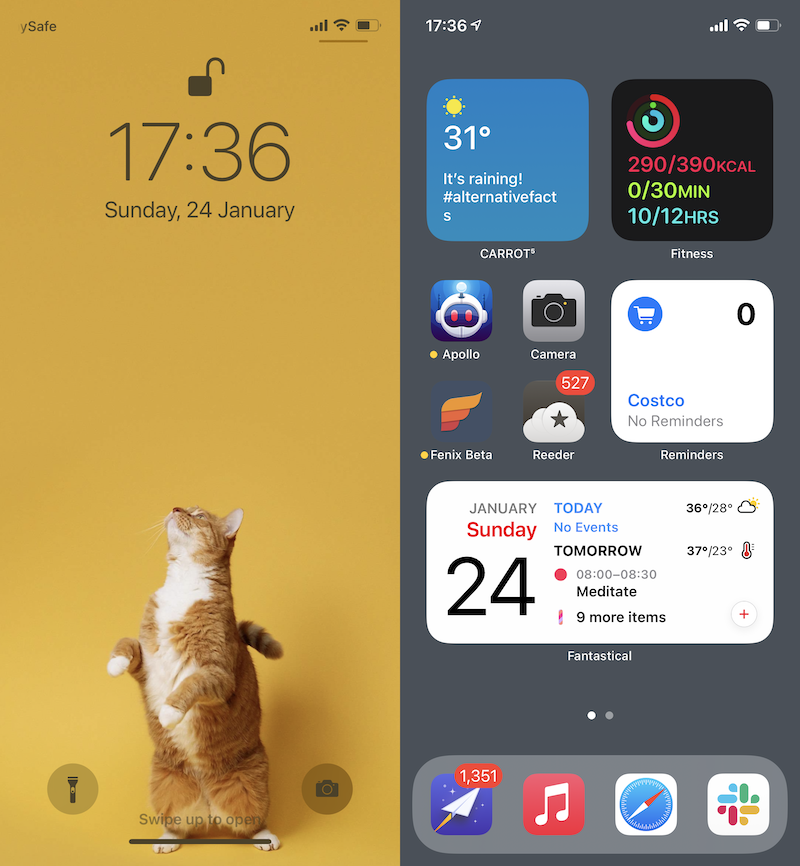

**An infrequently-updated list of things I’m into at the moment**

## Reading

Currently reading: [A Promised Land](https://app.thestorygraph.com/books/a707a369-7a46-4857-8177-638f74973d7b).

**Recently finished:** [AIright, Alright, Alright: The Oral History of Richard Linklater's Dazed and Confused](https://bookshop.org/books/alright-alright-alright-the-oral-history-of-richard-linklater-s-dazed-and-confused/9780062908506).

**Up next:** [Atomic Habits](https://app.thestorygraph.com/books/f7074d73-a059-4b76-90b8-37598117661c).

## Listening

The Stone Roses' [first album](https://music.apple.com/au/album/the-stone-roses-remastered/322969529). Apple Music's [Negative Space](https://music.apple.com/au/playlist/negative-space/pl.1da58413d0224761939ff710b825300f) and [Rise & Grind](https://music.apple.com/au/playlist/rise-and-grind/pl.937d9aefc9da498aaa627e7b62e318b4) playlists. 

## Watching

Loving [The Stand](https://www.imdb.com/title/tt1831804/) and [WandaVision](https://www.imdb.com/title/tt9140560/). No chance to get into [The Expanse](https://www.imdb.com/title/tt3230854) season 5 or [Letterkenny](https://www.imdb.com/title/tt4647692/) season 9, since school holidays means not much time for adult television. Five more days...

## Eating & Drinking

Eating a lot of garbage, still loving Holgate's [Love All](https://www.blackheartsandsparrows.com.au/products/75248/holgate-love-all-non-alcoholic-pale-ale-6pk).

## Homescreen

Wallpaper is from Vellum. Widgets are Carrot Weather and Fitness up top; a middle stack of various lists from Reminders; at bottom, a stack composed of Fantastical, NY Times, Weather Perfect, Newton, and Things.

*Updated: Jan 24, 2021* 