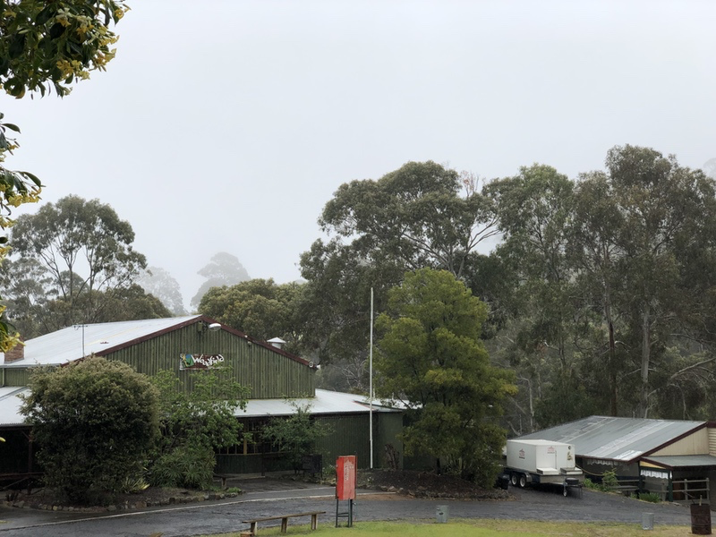
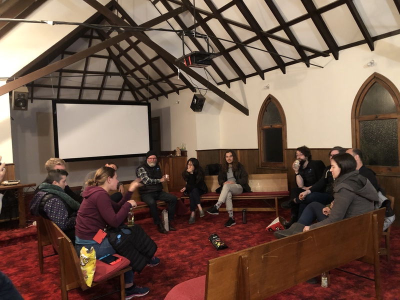

Rails Camps are one of my favourite things, which explains why this most recent one was my seventh in three-ish years, and the second I’ve co-organised.

There’s just something about getting away from civilisation, spending some time with good humans, hacking away on a project, and playing Werewolf all night.

This time around I even gave a talk, which was received well enough that I’m going to give it some polish and see what happens.

| | | |
| --- | --- | --- |
|  |  |  |

Ruby Australia has its general meeting and elections at Rails Camps, and this one marked the end of my tenure as President. I wish the new committee all the best and know they’ll do an amazing job.

And now, to sleep.