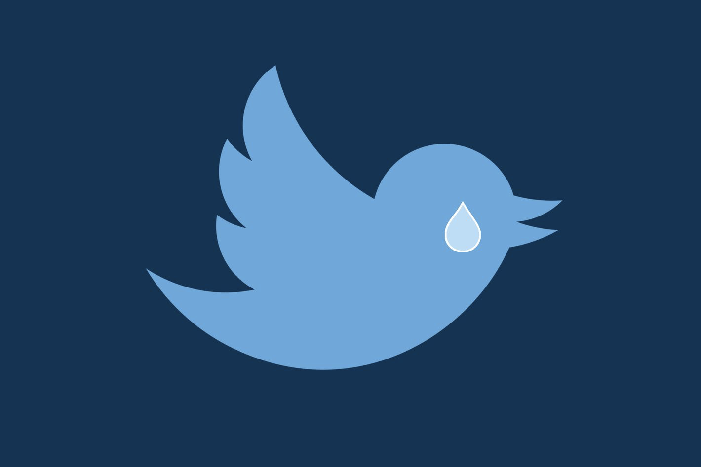

To paraphrase [this article](https://medium.freecodecamp.org/how-to-delete-your-past-tweets-in-bulk-and-for-free-save-yourself-from-your-past-self-f8844cdbda2), it’s far less likely that future society will be reading my tweets to gain insight into who I was than it is that some asshole will trawl through my Twitter feed to find some tweet where I sounded like a jerk. So I’ve [deleted](https://github.com/QuincyLarson/delete-tweets) about 63,000 tweets, leaving only the last 12 months, and every month I’ll delete another 30 days worth.

I’m not leaving Twitter just yet, but it won’t be such a big deal anymore if I have to.

Liberating.

*edit*: I left.

*edit2*: And then Alex Jones was asked to leave, and I went back.