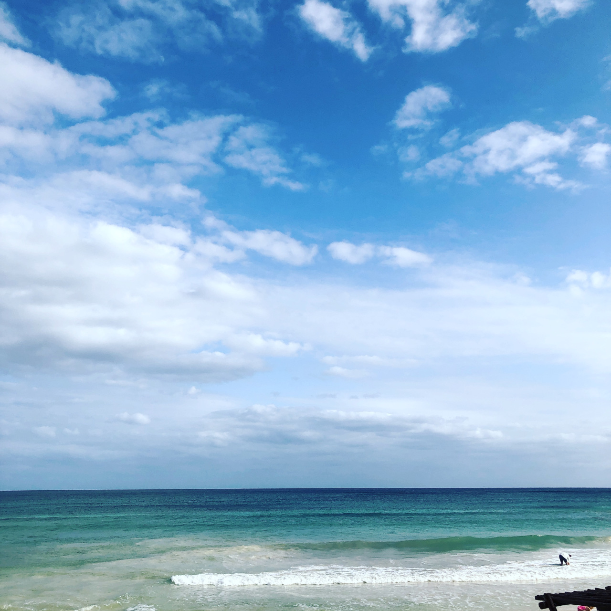
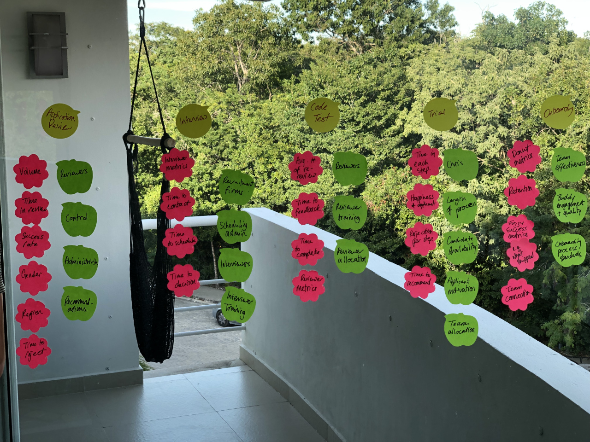
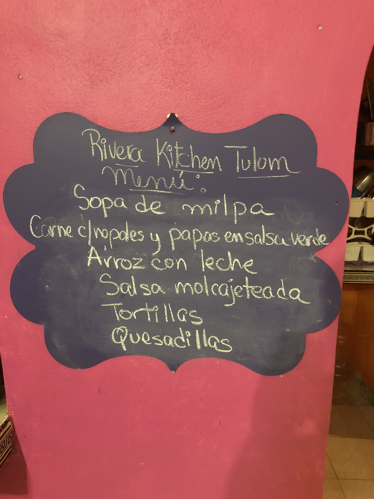
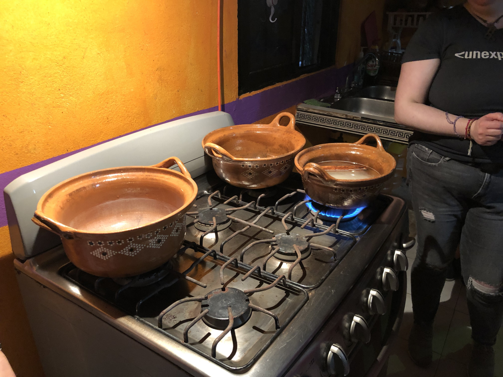

Meetups are a pretty key feature of working in a distributed company. They’re how you get to really know your colleagues, how you build a culture, and how you build and sustain relationships with people who are otherwise just text on a screen.

Our trip to Mexico was my third meetup, counting our all-company Grand Meetup in September. We got an amazing amount done, which is what happens when you put really clever people in a room for a week and stuff them full of good food.

We also had time for some fun activities, which also mostly centred around food. We visited someone’s home and learned how to make salsa verde, corn tortillas and carne con nopales…

| | | 
| --- | --- | 
|  |  |

…and we went into the Mayan jungle to zip line through the trees and swim in cenotes.

| | |
| --- | --- |
|  |  |

All in all, meetups are good and if you get the chance to go on one, I highly recommend them.

