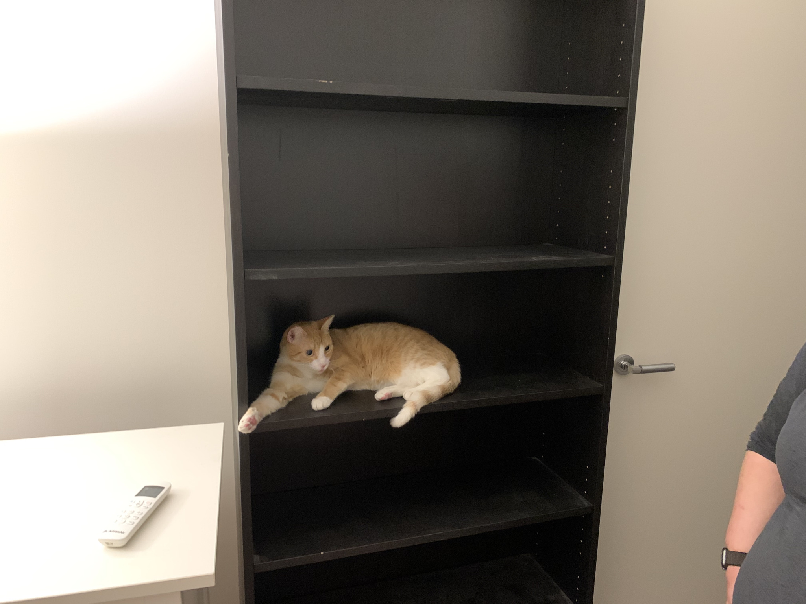

Don't let the door hit you on the way out.

## Recap

### January

New year, new car, new nephew.

### February

| | | |
| --- | --- | --- |
|  |  |  |

| | | 
| --- | --- |
|  |  |

 

Josie started grade 2, Alex started foundation – peace and quiet in the house six hours a day, five days a week. Co-organised [RubyConf AU 2019](https://www.rubyconf.org.au/2019), along with [Pat](https://twitter.com/pat), [Caitlin](https://twitter.com/caitlinpb), [Sam](https://twitter.com/sj26), [Phil](https://twitter.com/philnash) and [Sharon](https://twitter.com/sharon_av). Spoke at [WordCamp Bangkok](https://wordpress.tv/2019/07/04/toby-nieboer-remote-working-why-you-should-or-shouldnt-embrace-it-lightning-talks/), fell in love with [Bonchon](https://bonchon.com/) chicken, ate Bangkok’s [best tom yum](https://foursquare.com/v/พออ-paor/4b545bd0f964a52093b827e3), went to a [cat cafe](https://www.instagram.com/caturdaycatcafe/).

### March

| | | |
| --- | --- | --- |
|  |  |  |

| | | 
| --- | --- |
|  |  |

Spoke at [WordCamp Cebu](https://2019.cebu.wordcamp.org/speakers/), hung out in Hong Kong a little on the way back but didn’t have time to do much. Saw Captain Marvel. Spoke at [WordCamp Kathmandu](https://wordpress.tv/2019/05/07/toby-nieboer-remote-working-why-you-should-or-shouldnt-embrace-it/), visited some temples, narrowly avoided being mugged and/or ripped off twice.

### April

  

| | | |
| --- | --- | --- |
|  |  |  |

   

Team meetup in Phuket. Lots of work, but also [hung out with tigers](https://www.tigerkingdom.com/phuket) and [went sailing](http://www.phuketsailtours.com/index.htm). Spent the day in Singapore on the way back, saw Avengers Endgame, did some shopping.

### May

[Eurovision](https://twitter.com/search?q=eurovision%20from%3Atcn33%20since%3A2019-01-01&src=typeahead_click&f=live)! (Joel and Myf are the worst – sadly, [SBS](https://www.sbs.com.au/programs/eurovision) did not find new hosts for 2020.) Federal election, in which the schadenfreude of seeing [Tony Abbott defeated](https://www.theguardian.com/global/2019/may/18/australian-election-tony-abbott-loses-his-warringah-seat-to-zali-steggall) was diminished by [Bill Shorten losing](https://www.theguardian.com/australia-news/2019/may/19/labor-faithful-shock-stunning-election-defeat-shorten) an unloseable election. The girls and I did a portrait photography class at the Apple Store.

### June

| | | |
| --- | --- | --- |
|  |  |  |

| | | 
| --- | --- |
|  |  |

Two weeks in CO for Rob and Beth’s wedding ❤️ Drove a Mustang around, visited old haunts, went to a [Rockies](https://www.mlb.com/rockies) game, caught up with many old friends, went whitewater rafting. So grateful to Brie and Charlie for the hospitality!

### July

 

Rare month without travel. Josie discovered she likes climbing. Signed a lease for our new house in [Yarra Bend](https://yarrabend.com.au/) – a massive improvement on our old shoebox. Met Pippa 😍

### August

| | | 
| --- | --- |
|  |  |

Moved house – never, ever again. Attended Josie’s concert, in which she had a lead role. Had a hand in some [research](https://developer.wordpress.com/2019/08/28/sharing-the-data-how-technical-women-navigate-their-career/) we published at work. Visited Brisbane for Caitlin and Geoffrey’s wedding ❤️

Scarlett has picked out her spot in the new house.

### September

| | | 
| --- | --- |
|  |  |
|  |  |

[Automattic’s](https://automattic.com) Grand Meetup was in Orlando again, this time during my 45th birthday.

### October

| | | |
| --- | --- | --- |
|  |  |  |
|  |  |  |

| | | 
| --- | --- |
|  |  |
|  |  |
|  |  |
|  |  |

Back to the US for the third time this year. Spent a lot of the month in Washington, DC ([phpworld](https://world.phparch.com/)) and St Louis ([WordCamp US](https://2019.us.wordcamp.org/)). Did quite a bit of exploring in DC, but did not get to the [Air & Space Museum](https://airandspace.si.edu/) or the [Udvar-Hazy Center](https://airandspace.si.edu/udvar-hazy-center). Went to the top of the [Gateway Arch](https://www.gatewayarch.com/) in St Louis and took in a [Blues](https://www.nhl.com/blues) game – the [Enterprise Center](http://www.enterprisecenter.com/) is an amazing fan experience. Many excellent carbs.

### November

Back home. Visit with my folks, in part to say goodbye to Baillie 😢

### December

| | | 
| --- | --- |
|  |  |

Frozen 2 with the girls, team meetup in Da Nang, Xmas with family and a sorely needed break to hang out and do nothing for once. Finished the year with Star Wars and said [goodbye](https://twitter.com/tcn33/status/1205887256533196801?s=20) to 2019 with all the respect it deserved.

## Stats

### Travel

- **Countries visited:** 6 – Thailand (twice), Philippines, Nepal, Singapore (twice), US (three times), Vietnam (⬇️ 14%)
- **Flights:** 37 (⬆️ 3%)
- **Distance flown:** 192,729 km (⬆️ 42%)
- **Time in the air:** 249 hours (⬆️ 36%)
- **Swarm checkins:** 1,331 (⬇️ 14%)
- 🆕 **Swarm mayorships:** 60 (⬆️ 5%)
- 🆕 **Status:** Premier Platinum with United 🎉

### Music

- **Minutes:** 11,293 (⬇️ 8%)
- **Top artists:** Taylor Swift, Blackpink 🆕, Beastie Boys, Silversun Pickups, Blood Red Shoes

### Books

> You have read 80 of 40 books in 2019. 
-- <cite>[*goodreads.com*](http://goodreads.com/)</cite>

This was mostly due to Kindle Unlimited being linked to Goodreads. The best things I read this year were probably [Midnight in Chernobyl](https://www.goodreads.com/book/show/40538681-midnight-in-chernobyl?ac=1&from_search=true&qid=9D59jr3e5Q&rank=1) and [Bad Blood](https://www.goodreads.com/book/show/37976541-bad-blood).

2020’s goal is 100 books.

### Health

- **Steps:** 1,380,795 (⬇️ 17% – largely due to working from home)
- **Weight:** ⬆️ 10% 😭
- Sleep stats were not tracked consistently as I can no longer wear my Apple Watch 🙁

*This post was made possible by Google Timeline, Google Photos, Swarm and (what remains of) my Twitter history compensating for my woeful memory.*