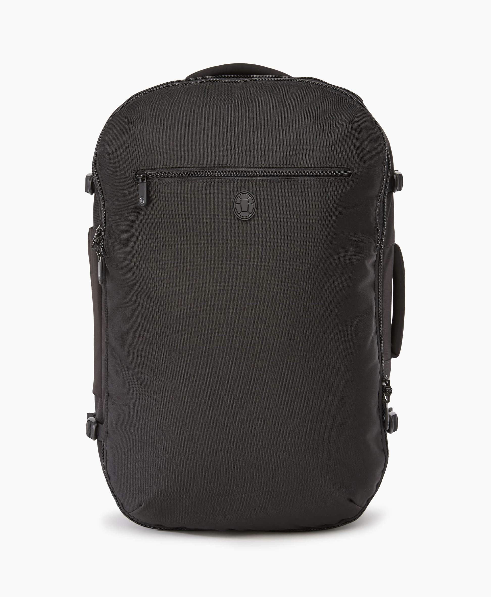

I’ve been shopping around for a new travel bag, and I’d pretty much decided on the [Tortuga Setout Backpack](https://www.tortugabackpacks.com/products/setout-travel-backpack)… then I read [this article](https://www.businessinsider.com/tortuga-setout-backpack-review-carry-on-luggage-2018-3/?r=AU&IR=T) and was definitely sold:

> Tortuga’s team is distributed, meaning that everyone sets their own hours and chooses where to live and work. In effect, that means that as long as they have access to Wi-Fi, Team Tortuga can travel nonstop.

Hey, that [sounds familiar](https://automattic.com/work-with-us) 😄

Now the only question is whether I can get it before the Grand Meetup in late September. Living in Australia is great until you need to buy things on the internet 😭