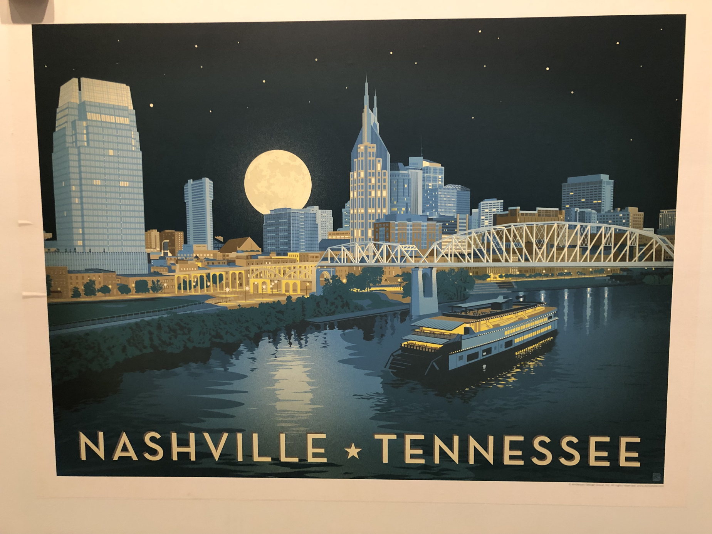
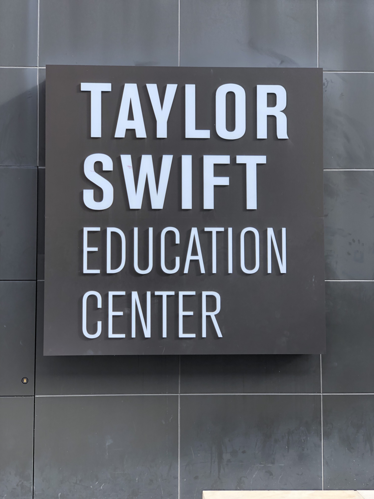

WordCamp US in Nashville was super fun. Met a whole lot of cool developers, customers and fellow Automatticians. 

| | | |
| --- | --- | --- | 
|  |  |  |

| |
| --- | --- |
|  |  |

Really enjoyed wandering around downtown. Sadly, the Preds weren’t in town though.

 
 

Definitely looking forward to visiting again sometime. See you next year in St Louis!